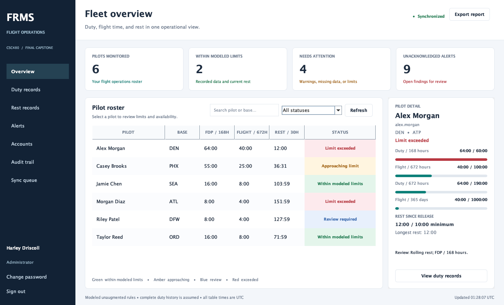

# Flight Duty & Fatigue Risk Management System

A complete Java desktop capstone for CSC480, developed by Harley Driscoll. FRMS connects flight and duty records, rest tracking, explainable Part 117 assessments, fleet alerts, and persistent SQL data in one workspace.



## Build and run

Use JDK 17 or newer and Maven 3.9 or newer:

```sh
mvn clean verify
java -jar target/flight-duty-frms-1.0.0.jar --database demo/frms.sqlite
```

The JAR includes SQLite and all runtime dependencies. No Spring Boot, application server, database server, or separate JDBC installation is required.

In IntelliJ, import **pom.xml**, reload Maven dependencies, and run **Main.main()**. Development launch:

```sh
mvn exec:java -Dexec.args="--database demo/frms.sqlite"
```

On this Mac, IntelliJ's bundled Maven is at **/Applications/IntelliJ IDEA.app/Contents/plugins/maven-plugin/lib/maven3/bin/mvn** if Maven is not on the shell path.

A new database is seeded once with two operations accounts and six pilots:

| Access | Username | Password |
| --- | --- | --- |
| Administrator | admin | admin |
| Dispatcher | dispatcher | dispatch-demo |
| Pilot | alex.morgan | pilot-demo |

Other seeded pilots also use **pilot-demo**. The sample fleet demonstrates clear, approaching-limit, exceeded-limit, and review states. Existing records and accounts are preserved; demo credentials apply to newly seeded databases.

## Application workflows

- **Overview:** live search, status filtering, pilot details, utilization, rest, and open findings. Refresh runs every 30 seconds and after changes.
- **Duty records:** create, read, edit, and delete actual FDP records, individual block-out/block-in times, and release from all duty. **Evaluate assignment** previews future scenarios without saving them.
- **Rest records:** log completed rest and uninterrupted sleep opportunity.
- **Alerts:** examine findings and record review notes. Acknowledgement preserves severity; corrections recalculate and resolve findings.
- **Accounts:** administrators manage profiles, roles, and password resets. All users can change their own password.
- **Audit trail:** inspect the latest 250 authorized change and review events.
- **Sync queue:** inspect locally journaled writes, retry synchronization, and discard conflicting drafts after review.
- **Export report:** save UTF-8 CSV fleet, duty, rest, alert, or audit reports with freshness metadata.

Pilots see and modify their own records. Dispatchers and administrators monitor the fleet and review alerts. Account administration requires the Administrator role. Permissions are checked by the service and again during journal replay.

## Rules and scope

The engine implements unaugmented Table A flight limits, all Table B FDP bands/segments, the non-acclimated reduction, conditional pre-takeoff FDP extensions, rolling 60/190-hour FDP and 100-hour flight limits, the 1,000-hour calendar-day-window flight limit, 30 hours free from duty within 168 hours, and ordinary 10-hour-rest/8-hour-sleep-opportunity requirements. Warnings begin at 90% utilization.

Flight, FDP, and release times are separate. Individual flight-leg instants yield exact partial-window totals. Opening lifetime flight hours are profile data and never replace rolling history. Missing legacy flight data produces **Review required** and unknown availability.

This is an educational prototype, not an FAA-approved dispatch system. Additional operating circumstances—including augmented, reserve, split duty, deadhead, travel, consecutive-nighttime, post-takeoff-extension, and emergency provisions—require specialist review. Part 117 governs covered air-carrier operations; it is not a general duty regulation for every flight school. See [the regulatory basis and assumptions](docs/REGULATORY_SCOPE.md).

## Persistence and recovery

The default database is **.frms/frms.sqlite** under the user's home directory. Choose another file with **--database**, the **frms.database** Java property, or **FRMS_DATABASE**, in that order. Its durable journal is the sibling directory **<database filename>.outbox**.

Operational changes are journaled atomically before SQL is attempted. Temporary database errors receive three attempts with short backoff. An authenticated session can continue with cached records and local drafts during an outage; freshness is visibly marked. Sign-in and account changes require online access.

Recovery rechecks current permissions, overlaps, and record revisions. Processed-command identifiers prevent duplicate writes after a restart. Conflicts stay queued and never overwrite newer records. If the local journal cannot be written, the action reports failure.

Migrations preserve existing records and legacy time precision. Successful legacy SHA-256 sign-in upgrades the password to salted PBKDF2. Usernames become lowercase; ambiguous duplicates or invalid legacy identifiers stop migration while preserving the original database. The local database and operational journal are unencrypted; production use requires a separate security and regulatory validation effort.

To start without samples:

```sh
java -jar target/flight-duty-frms-1.0.0.jar --database data/frms.sqlite --no-demo
```

A new empty database prompts for the first administrator password. New/reset passwords require 10–128 characters. **--headless** supports initialization; an empty **--no-demo** headless start additionally requires **FRMS_ADMIN_PASSWORD**.

## Verification and deliverables

**mvn verify** runs Checkstyle, unit/integration/system tests, and creates the executable JAR. The optional real Swing workflow runs in a graphical session:

```sh
FRMS_UI_TEST=true mvn -Dtest=DesktopSmokeTest test
```

The GUI test captures only FRMS components into **target/ui-preview/**, without capturing the desktop. GitHub Actions is configured to verify Java 17 and 21, smoke-test the JAR, and upload build/test artifacts.

- [CT1–CT7 requirements map](docs/REQUIREMENTS.md)
- [Architecture and runtime diagrams](docs/ARCHITECTURE.md)
- [Regulatory scope](docs/REGULATORY_SCOPE.md)
- [Presentation guide](docs/PRESENTATION.md)
- [Verification evidence](docs/VERIFICATION.md)
- [Contribution and review standards](CONTRIBUTING.md)
