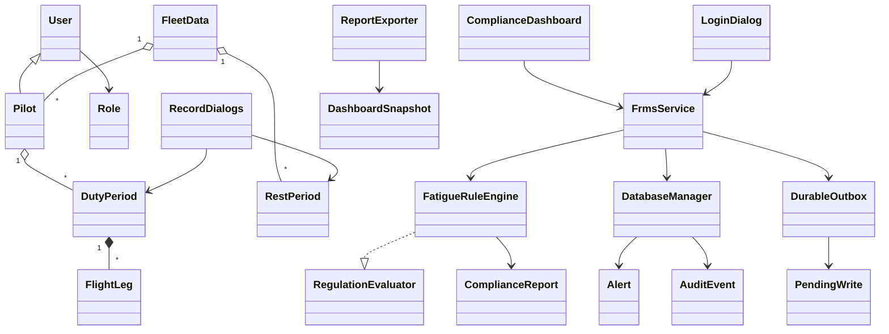
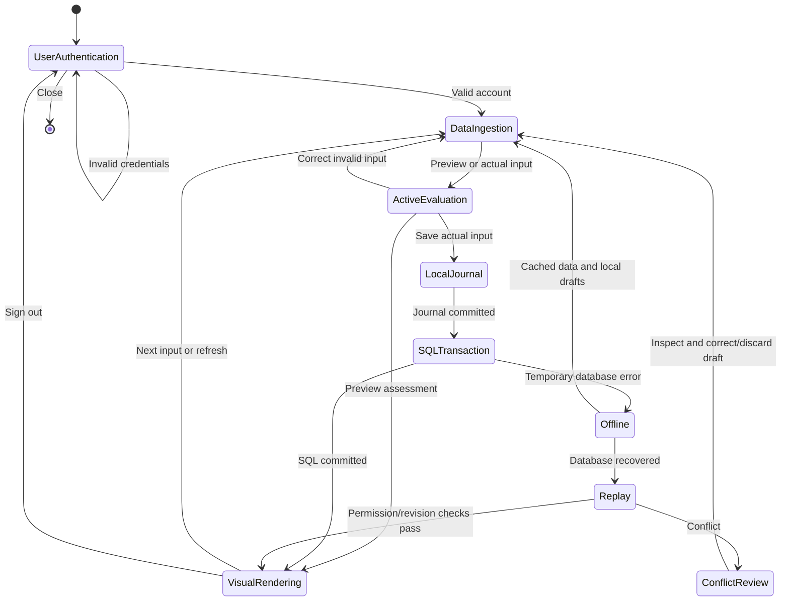

# Architecture and runtime behavior

Swing renders the desktop, FrmsService enforces authenticated workflows, FatigueRuleEngine calculates modeled rules, and SQLite stores relational data.

## Runtime states

## Data and transactions

Tables: pilots, duty_periods, flight_legs, rest_periods, alerts, audit_events, processed_commands. Existing integer duty IDs remain; stable UUIDs and revisions support journaling and conflict detection. Foreign keys cascade operational records on deletion.

Fleet data is read through four bulk queries in one SQL snapshot. HashMaps associate histories with users; lists retain interval order. Duty instants are resolved once. Unchanged historical reports are cached against complete immutable duty/rest values. Changed findings are updated and removed findings resolved.

A mutation, its processed-command ID, and its audit entry commit together. Revision predicates prevent overwriting newer edits. Failure rolls back the transaction.

The local journal uses versioned XML properties with bounded input. Operational fields and actor identity are stored; passwords and hashes are excluded. A flushed temporary file is renamed atomically. Filename ordering preserves command order. A conflicting pilot's subsequent writes wait while unrelated pilots can synchronize. Replay checks current roles and committed command IDs.

No offline sign-in is allowed. Existing authenticated sessions can use cached data and operational drafts. Account changes require online access.

## Rendering and concurrency

A single dashboard worker performs SQL, journaling, export, and evaluation work. Swing updates occur on the event-dispatch thread. Sign-in hashing uses SwingWorker. Refresh occurs every 30 seconds and after changes.

Editors use named zones; tables/exports use UTC. Typed instant/duration values support sorting. Statuses carry text labels as well as colors.

The database schema is created at runtime; the IDE SQL resolver may lack a configured source, while integration tests execute the SQL against SQLite. Run IDE and Maven builds sequentially when both use target/classes.
